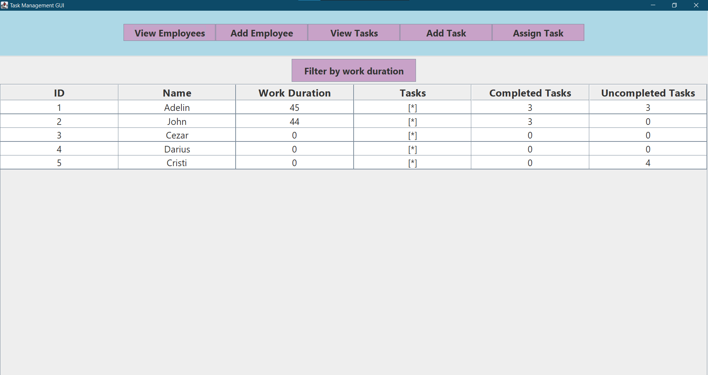

📋 Tasks Management Application
Welcome to the Tasks Management Application! This is a lightweight, desktop-based task management tool built entirely in Java. It provides a clean graphical interface to help users organize, track, and manage their daily tasks directly from their desktop without needing an internet connection or a complex database setup.

📖 Project Overview
This application was developed to provide a straightforward, no-fuss approach to productivity. By leveraging Java Swing for the Graphical User Interface and Java Object Serialization for data persistence, the application runs entirely locally. Your task data is saved directly to a local file, ensuring that your to-do lists and project tracking persist seamlessly between application restarts.

✨ Key Features
Desktop Native UI: A responsive and intuitive graphical interface built with Java Swing components (Tables, Panels, Dialogs).

Full Task Control: Create, read, update, and delete tasks with just a few clicks.

Status & Priority Tracking: Organize your workflow by assigning priorities and tracking whether tasks are pending, in progress, or completed.

Local Data Persistence: Uses Java Serialization to save the state of your tasks to a local file automatically—no SQL database required.

Offline Functionality: Since everything is stored locally, the app requires zero internet access or external servers to function.

## 📸 Screenshots

Here is a look at the application's interface:

  
*Above: The main dashboard showing the overview of all employees.*

  
*Above: The overview of all tasks, simple and complex.*

💻 Tech Stack & Architecture
Language: Java (Core SE)

User Interface: Java Swing

Data Persistence: Java Serialization (java.io.Serializable, ObjectOutputStream, ObjectInputStream)

Architecture Concept: Object-Oriented Programming (OOP) principles tailored for desktop event-driven applications.

💾 How the Persistence Works
Instead of setting up a relational database, this application implements the Serializable interface on the core data models (like the Task class). 
When the application is closed or data is saved, the internal list of Java objects is converted into a byte stream and written to a local .dat or .ser file.
Upon launching the app, the byte stream is read and deserialized back into active Java objects, instantly restoring your previous session.

🚀 Getting Started
Prerequisites
Java Development Kit (JDK): Version 8 or higher is required to run the Swing application.

IDE (Optional): IntelliJ IDEA, Eclipse, or NetBeans for viewing and modifying the source code.

Installation & Running the App
Clone the repository:

Bash
git clone https://github.com/Adelinn77/Tasks-Management-Application.git
Open the Project:

Open the cloned folder in your preferred Java IDE.

Compile and Run:

Locate the main executable class (usually containing the public static void main(String[] args) method that initializes the Swing JFrame).

Run the file directly from your IDE.

Data File:

Once you create your first task, the application will automatically generate the serialized data file in the project root directory to store your entries.
